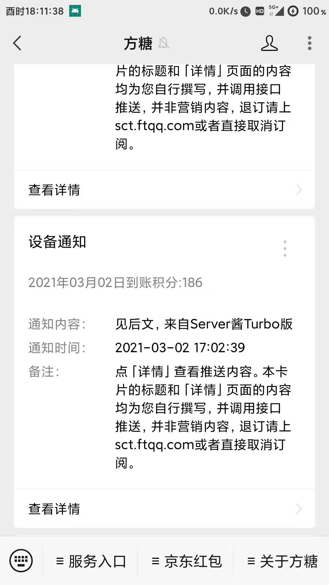

<div align="center">
<h1 align="center">
JDRouterPush
</h1>
</div>

## 项目简介

本项目调用京东云无线宝API,可每天定时推送积分收益情况,帮助你更好的观察主要信息

## 更新日志
### 2021-02-25: 
1. 实现多设备查询
2. 查询今日收益,总收益,可用收益
3. 设备在线天数
4. 可查看最近七条积分动态

## 使用说明

### Actions 方式

1. **Fork 本项目**
2. **获取京东云无线宝wskey**
- 目前只用Android抓包演示（抓包工具有很多，这里使用HttpCanary作为演示）

- 打开HttpCanary点击右下角按钮开始抓包

  

- 然后再打开京东云无线宝,点击积分管理

  

- 回到HttpCanary，右上角找到搜索，搜索`wskey` 

  

- 然后随便点击一条进去，找到请求里面的`wskey` ，复制值

  

3. **点击项目 Settings -> Secrets -> New Secrets 添加以下 2 个 Secrets，其中server酱微信推送的sckey可参阅[微信订阅通知](#微信订阅通知)**

| Name          | Value                |
| ------------- | -------------------- |
| WSKEY         | 从京东云无线宝中获取 |
| SERVERPUSHKEY | server酱推送的sckey  |

​	

1. **开启 Actions 并触发每日自动执行**

**Github Actions 默认处于关闭状态，需要手动开启 Actions ，执行一次工作流，验证是否可以正常工作。**


如果需要修改每日任务执行的时间，请修改 `.github/workflows/JDPush.yml`，在第 7行左右位置找到下如下配置。

```yml
  schedule:
    - cron: '30 22 * * *'
    # cron表达式，Actions时区是UTC时间，需要往前推8个小时  此时为6点30推送
    # 示例： 每天晚上22点30执行 '30 14 * * *'
```

*如果收到了 GitHub Action 的错误邮件，请检查 WSKEY是不是失效了，如果退出或重登都会导致京东云无线宝 `WSKEY` 失效*


## 微信订阅通知

### 订阅执行结果

1. 前往 [sc.ftqq.com](http://sc.ftqq.com/3.version) 点击登入，创建账号（建议使用 GitHub 登录）。

2. 点击点[发送消息](http://sc.ftqq.com/?c=code) ，生成一个 Key。将其增加到 Github Secrets 中，变量名为 `SERVERPUSHKEY`

3. [绑定微信账号](http://sc.ftqq.com/?c=wechat&a=bind) ，开启微信推送。
    

4. 推送效果展示
     
