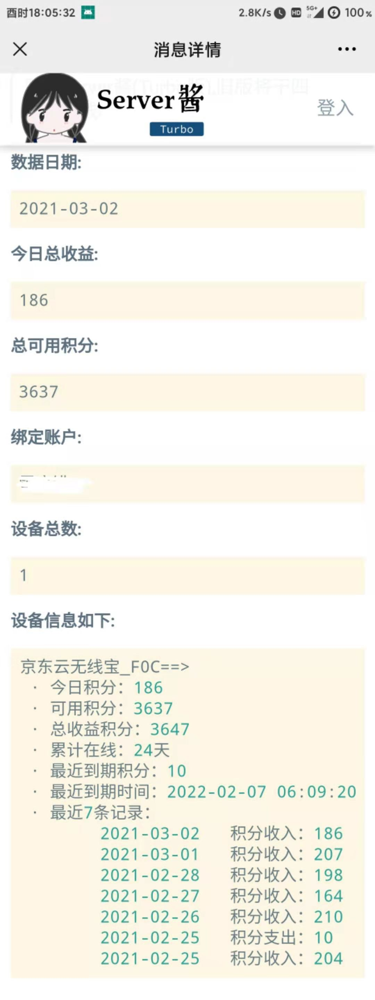

<div align="center">
<h1 align="center">
JDRouterPush
</h1>
</div>

## 项目简介

本项目调用京东云无线宝API,可每天定时推送积分收益情况,帮助你更好的观察主要信息,不收集用户任何信息.

## 项目功能

***当前版本:  20210423***

1. 查询今日总收益，设备总收益
2. 查询绑定账户
3. 单个设备积分收益情况，积分到期提醒，积分操作记录
4. 支持多设备查询
5. 支持自定义设置设备名，自动获取设备名，操作记录条数
6. 支持查看当前网速,ip，路由模式,固件版本,插件状态,插件版本,缓存大小
7. 支持查看设备开机时间与PCDN
8. 推送支持servier酱,Telegram,Bark,pushplus,企业微信(支持文本推送/图文推送两种方式)

## 更新日志

### 2021-04-23:
1. 企业微信添加图文推送方式

### 2021-04-13:
1. 自动获取设备名称,优先自定义
2. 添加企业微信通知
3. 添加当前网速,当前ip，路由模式,固件版本,插件状态,插件版本,缓存大小等

### 2021-03-04: 
1. 支持自定义设置设备名称
2. 支持自定义设置记录条数

### 2021-03-02: 
1. 查询绑定的京东账户
2. 通知排版优化
3. 脚本检测更新
4. 支持Server酱Turbo版

### 2021-02-25: 
1. 实现多设备查询
2. 查询今日收益,总收益,可用收益
3. 设备在线天数
4. 可查看最近七条积分动态

## 使用说明

### Actions 方式

1. **Fork 本项目**
2. **获取京东云无线宝wskey**
- 目前只用Android抓包演示（抓包工具有很多，这里使用HttpCanary作为演示）

- 打开HttpCanary点击右下角按钮开始抓包

  

- 然后再打开京东云无线宝,点击积分管理

  

- 回到HttpCanary，右上角找到搜索，搜索`wskey` 

  

- 然后随便点击一条进去，找到请求里面的`wskey` ，复制值

  

3. **点击项目 Settings -> Secrets -> New Secrets 添加以下 2 个 Secrets，其中server酱微信推送的sckey可参阅[微信订阅通知](#微信订阅通知)**

| Name          | Value                                    | 是否必填 |
| ------------- | ---------------------------------------- | -------- |
| WSKEY         | 从京东云无线宝中获取                    | 必填     |
| SERVERPUSHKEY | server酱推送的sckey                    | 非必填   |
| DEVICENAME    | 格式：mac后6位:设置的名称，多个使用&连接 | 非必填   |
| RECORDSNUM    | 需要设置的获取记录条数   不填默认7条     | 非必填   |
| TG_BOT_TOKEN  | Telegram推送服务Token     | 非必填   |
| TG_USER_ID    | Telegram推送服务UserId     | 非必填   |
| BARK          | bark消息推送服务,secrets可填;形如jfjqxDx3xxxxxxxxSaK的字符串   | 非必填   |
| PUSHPLUS          | pushplus推送服务Token   | 非必填   |
| ACCESSTOKEN          | 企业微信access_token   | 非必填   |
| CORPID          | 企业ID（如果已经填写ACCESSTOKEN  则无需填写这个）| 非必填   |
| CORPSECRET          | 应用的凭证密钥secret（如果已经填写ACCESSTOKEN  则无需填写这个）| 非必填   |
| TOUSER          | touser指定接收消息的成员  默认为“@all”   | 非必填   |
| AGENTID          | agentid企业应用的id   | 非必填   |
| THUMB_MEDIA_ID          | 企业微信素材库图片id   | 非必填   |
| AUTHOR          | 企业微信文章作者名字   | 非必填   |

***DEVICENAME***变量填写例子：

例如：完整mac为：ABC12D456EF7(取后6位)    想设置为韭菜1号

单个设备：456EF7:韭菜1号

多个设备：456EF7:韭菜1号&789FE1:韭菜2号&123FR2:韭菜3号             （中间使用&连接即可）

***THUMB_MEDIA_ID***变量填写说明:

不填写此变量直接推送text文本格式（由于text/card等推送方式存在字数限制，所以大于3台设备的同学尽量使用图文推送）

填写此变量直接推送图文格式文章，类似于公众号文章。图片id请登入网页版进入素材库上传一张图片之后点击下载链接，在下载链接内有media_id=xxx（&结尾）

***AUTHOR***变量填写说明:

图文文章作者名字，设置了THUMB_MEDIA_ID就必须填写。


​	

1. **开启 Actions 并触发每日自动执行**

**Github Actions 默认处于关闭状态，需要手动开启 Actions ，执行一次工作流，验证是否可以正常工作。**


如果需要修改每日任务执行的时间，请修改 `.github/workflows/JDPush.yml`，在第 7行左右位置找到下如下配置。

```yml
  schedule:
    - cron: '30 22 * * *'
    # cron表达式，Actions时区是UTC时间，需要往前推8个小时  此时为6点30推送
    # 示例： 每天晚上22点30执行 '30 14 * * *'
```

*如果收到了 GitHub Action 的错误邮件，请检查 WSKEY是不是失效了，如果退出或重登都会导致京东云无线宝 `WSKEY` 失效*


## 订阅通知

### 订阅执行结果

目前Turbo版本的消息通道支持以下渠道

- 企业微信应用消息
- Android
- Bark iOS
- 企业微信群机器人
- 钉钉群机器人
- 飞书群机器人
- 自定义微信测试号
- 方糖服务号

1. 前往 [sct.ftqq.com](https://sct.ftqq.com/sendkey)点击登入，创建账号。
2. 点击点[SendKey](https://sct.ftqq.com/sendkey) ，生成一个 Key。将其增加到 Github Secrets 中，变量名为 `SERVERPUSHKEY`
3. [配置消息通道](https://sct.ftqq.com/forward) ，选择方糖服务号，保存即可。
4. 推送效果展示
     

**旧版推送渠道[sc.ftqq.com](http://sc.ftqq.com/9.version)即将于4月底下线，请前往[sct.ftqq.com](https://sct.ftqq.com/sendkey)生成`Turbo`版本的`Key`
注意，申请Turbo版Key后请配置消息通道，如果想沿用以前的微信推送方式，选择方糖服务号即可**

